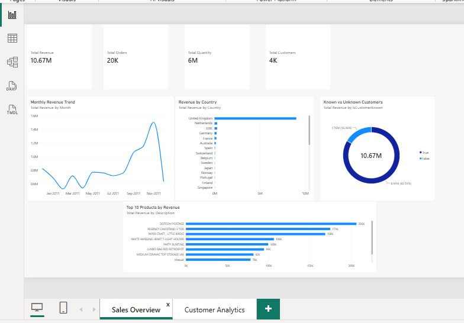
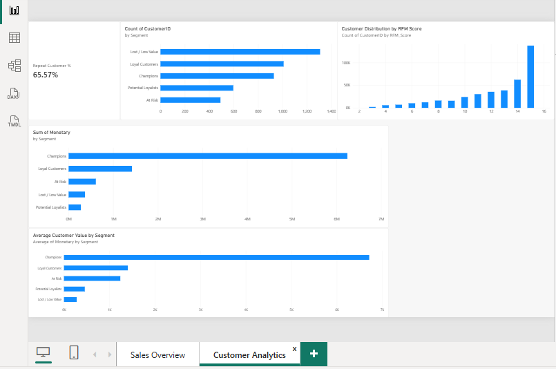

# Retail Sales & Customer Analytics

An interactive **Power BI business intelligence project** developed to analyze retail sales performance, customer behavior, product performance, geographic revenue distribution, and customer value.

The project combines **sales analytics with RFM (Recency, Frequency, Monetary) customer segmentation** to identify high-value, loyal, potential, at-risk, and low-value customer groups and support data-driven retention and marketing decisions.

---

## 📊 Project Overview

The dashboard provides a business-focused analysis across two interactive pages:

### 1. Sales Overview

Provides a high-level view of retail performance through:

- Total revenue
- Total orders
- Total quantity sold
- Total customers
- Monthly revenue trends
- Revenue by country
- Known vs. unknown customer analysis
- Top 10 products by revenue

### 2. Customer Analytics

Provides customer-focused insights using RFM analysis:

- Repeat customer percentage
- Customer distribution by RFM segment
- Customer distribution by RFM score
- Monetary contribution by customer segment
- Average customer value by segment

---

## 🎯 Business Objectives

- Monitor overall retail sales performance
- Analyze revenue trends over time
- Identify high-performing countries
- Identify top-performing products by revenue
- Measure repeat customer behavior
- Segment customers using RFM analysis
- Identify high-value and loyal customers
- Identify at-risk and low-value customers
- Compare revenue contribution across customer segments
- Support targeted customer retention and marketing strategies

---

## 📈 Key Performance Indicators

| KPI | Result |
|---|---:|
| Total Revenue | 10.67M |
| Total Orders | 20K |
| Total Quantity | 6M |
| Total Customers | 4K |
| Repeat Customer % | 65.57% |

---

## 👥 RFM Customer Segmentation

RFM analysis evaluates customers using three behavioral dimensions:

| Dimension | Meaning |
|---|---|
| **Recency (R)** | How recently a customer made a purchase |
| **Frequency (F)** | How frequently a customer made purchases |
| **Monetary (M)** | How much a customer spent |

The individual R, F, and M scores are combined into an **RFM Score**, which is used to classify customers into actionable segments.

### Customer Segments

- 🏆 **Champions**
- 💙 **Loyal Customers**
- 🌱 **Potential Loyalists**
- ⚠️ **At Risk**
- 📉 **Lost / Low Value**

This segmentation helps identify customers who should be prioritized for retention, loyalty programs, re-engagement campaigns, or targeted promotions.

---

## 📊 Dashboard Features

### Sales Overview

- **Total Revenue KPI**
- **Total Orders KPI**
- **Total Quantity KPI**
- **Total Customers KPI**
- **Monthly Revenue Trend**
- **Revenue by Country**
- **Known vs. Unknown Customers**
- **Top 10 Products by Revenue**

### Customer Analytics

- **Repeat Customer %**
- **Customer Count by Segment**
- **Customer Distribution by RFM Score**
- **Monetary Contribution by Segment**
- **Average Customer Value by Segment**

---

## 🛠️ Tools & Technologies

- **Microsoft Power BI Desktop**
- **DAX**
- **Power Query**
- **CSV / Excel**
- **RFM Customer Segmentation**
- **Data Cleaning & Transformation**
- **Data Visualization**
- **Business Intelligence**

---

## 🔄 Data Preparation

The retail transaction data was prepared and transformed using **Power Query** before building the analytical dashboard.

Key preparation activities included:

- Data type validation
- Transaction data cleaning
- Date transformation
- Customer identification
- Revenue and quantity preparation
- Customer-level aggregation
- RFM dataset preparation
- Customer scoring
- Customer segmentation

DAX measures were then used to calculate key business metrics and support interactive dashboard analysis.

---

## 💡 Business Insights

The dashboard enables users to:

- Track overall revenue and sales performance
- Analyze monthly revenue movement
- Identify countries contributing the most revenue
- Identify products generating the highest revenue
- Understand the distribution of customers across RFM segments
- Identify high-value customers for retention strategies
- Identify at-risk customers for re-engagement campaigns
- Compare monetary contribution between customer segments
- Evaluate average customer value across segments
- Use customer behavior to support targeted marketing decisions

---

## 📷 Dashboard Preview

### Sales Overview



### Customer Analytics



---

## 📁 Project Structure

```text
retail-sales-customer-analytics/
│
├── Retail_Sales_Customer_Analytics.pbix
├── README.md
│
├── data/
│   └── customer_rfm.csv
│
└── screenshots/
    ├── sales-overview.png
    └── customer-analytics.png
```

## 🚀 How to Use

### Option 1 — Interactive Power BI Dashboard

Open the live Power BI dashboard:

**[🔗 View Interactive Power BI Dashboard](#)**

> The live dashboard link will be added after publishing the report.

### Option 2 — Power BI Desktop

1. Clone or download this repository.
2. Open `Retail_Sales_Customer_Analytics.pbix` using Power BI Desktop.
3. Navigate between the **Sales Overview** and **Customer Analytics** pages.
4. Interact with the available visuals and filters.

---

## 📌 Project Highlights

This project demonstrates practical experience in:

- Business Intelligence
- Power BI dashboard development
- Data cleaning and transformation
- Power Query
- DAX measures
- KPI development
- Interactive data visualization
- Sales performance analysis
- Customer behavior analysis
- RFM customer segmentation
- Customer value analysis
- Business-focused data storytelling

---

## 🎓 Skills Demonstrated

**Technical Skills**

`Power BI` · `DAX` · `Power Query` · `Data Cleaning` · `Data Transformation` · `Data Visualization` · `RFM Analysis`

**Analytical Skills**

`Sales Analytics` · `Customer Analytics` · `Customer Segmentation` · `KPI Analysis` · `Trend Analysis` · `Business Insights`

---

## 👩‍💻 Author

**Aishwarya Rani Sahu**

GitHub: Aishwaryaranisahu
